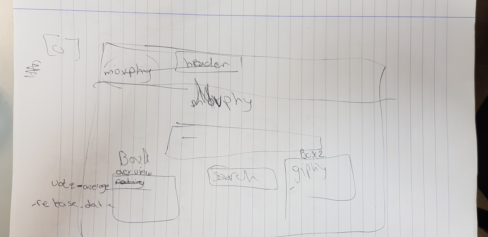

# movphy
Check our Website (URL)
----------------------
Using Movphy website you gain access to basic information about your movie plus a shot of unforgottable moment from the movie shown as a Giphy. In this website we used three different API's from two different websites.

-----------------------
Our first plan for the Website was:

-----------------------

Project Goals:
Designing an interactive website were user can search for a movie and gitting 2 results:
1) Movie details - overview, movie rating, release date
2) Giphy - A related Giphy for his search
-----------------------
APPI's:
Giphy - Lots and lots of GIFs - [https://developers.giphy.com/]
The Movie DB - Lots of info about all kinds of movies, a bit like IMDB - [https://www.themoviedb.org/documentation/api]
-----------------------
Defficulties:
Abeer's APROVE on the img Cover.
GIT ADD GIT PUSH GIT PULL MERGE ORIGIN (GIT COMMANDS)
To get the API url
-----------------------
** We were delighted to work with Abeer as a project manager.

